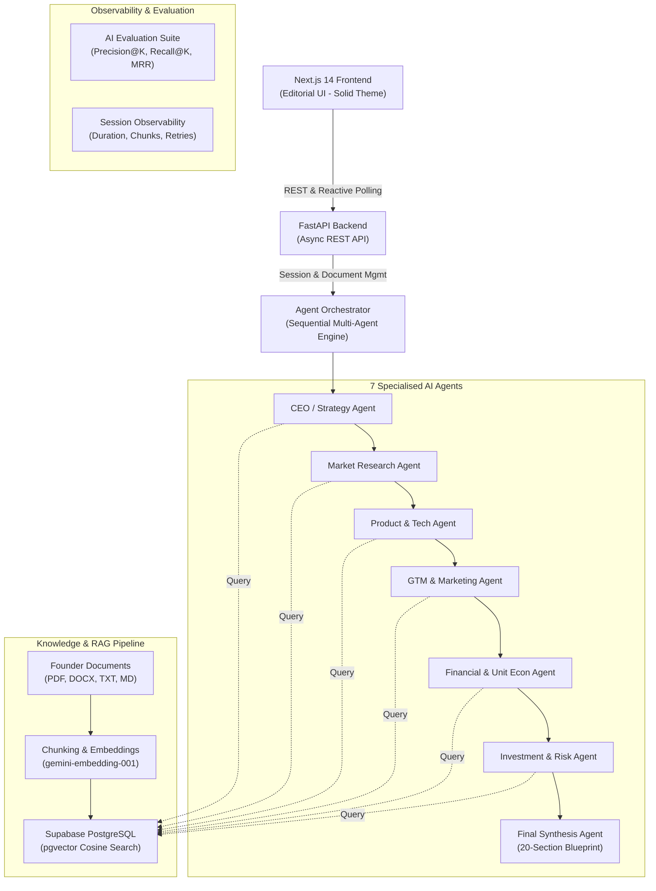

# VentureOS

**AI-Powered Multi-Agent Startup Intelligence Platform**

Submit a startup idea and upload founder documents. Receive an investor-grade, 20-section venture blueprint generated by a coordinated team of 7 specialised AI agents grounded in real founder documents via pgvector semantic search.

---

## Architecture Overview



---

## The 7 Specialised Agents

1. **CEO / Strategy Agent**: Synthesizes founder vision, core thesis, and defensive strategic moats.
2. **Market Research Agent**: Maps ICP personas, computes TAM/SAM/SOM, and analyses direct/indirect competitors.
3. **Product & Tech Agent**: Formulates MVP features, architecture, and technical feasibility guardrails.
4. **Marketing / GTM Agent**: Generates acquisition channels, viral growth loops, and positioning.
5. **Finance Agent**: Projects unit economics (CAC, LTV, payback), burn rate, and runway.
6. **Investment / Risk Agent**: Calculates calibrated venture score (0-100), red flags, and funding readiness.
7. **Final Synthesis Agent**: Consolidates all agent outputs into a cohesive 20-section report, surfaces contrarian contradictions, and crafts actionable 30/90-day execution roadmaps.

---

## RAG Knowledge Base Pipeline

```text
Founder Document Upload
       ↓
Text Extraction (pypdf, python-docx, utf-8)
       ↓
Text Normalisation (NFKC, whitespace sanitisation)
       ↓
Semantic Chunking (600 tokens + 100 token overlap)
       ↓
Vector Embeddings (Google Gen AI gemini-embedding-001, 768 dimensions)
       ↓
Storage in Supabase PostgreSQL (pgvector HNSW index)
       ↓
Agent-Specific Semantic Retrieval (match_document_chunks RPC)
       ↓
Grounded Agent Context with Source Attribution
```

---

## AI Evaluation Framework (Phase 8)

The built-in evaluation framework (`backend/app/evaluation/`) provides automated, deterministic quality measurement:

- **RAG Retrieval Quality**:
  - **Precision@K**: Proportion of top-K retrieved chunks matching expected topic identifiers.
  - **Recall@K**: Proportion of total expected knowledge sources successfully retrieved.
  - **Hit Rate@K**: Binary flag indicating if at least one relevant document was in top-K.
  - **Mean Reciprocal Rank (MRR)**: Evaluates the rank position of the first relevant chunk ($1/\text{rank}$).
- **Agent Structural Quality Checks**: Automated verification of required schema keys, score ranges, and actionable outputs across all 7 agents.
- **Grounding & Unsupported Claim Detection**: Validates that all items labeled as `FOUNDER EVIDENCE` cite real chunks present in retrieved context, flagging unsupported or fabricated references.
- **Regression Detection**: Compares evaluation metrics against baselines (`baseline_metrics.json`) to detect measurable degradation without failing for wording changes.

Run evaluation CLI:
```bash
cd backend
.venv\Scripts\python -m app.evaluation.run_evaluation
```

---

## Reliability & Production Hardening (Phase 9)

- **Configurable LLM Timeout**: 60-second execution deadline on Gemini API calls.
- **Exponential Backoff**: Automatic retry for 429 rate limit and temporary 5xx errors.
- **Structured Output Recovery**: 1-time automated JSON repair attempt on malformed model outputs before safe failure.
- **Concurrency & Double-Click Lock**: Rejects duplicate simultaneous analysis requests on sessions already in `processing` state.
- **File Upload Hardening**:
  - Max upload size: 10 MB.
  - Allowed extensions: `.pdf`, `.docx`, `.txt`, `.md`.
  - Empty file detection and strict filename sanitisation.
- **Central Exception Handling**: Sanitised error payloads (`detail`, `error_code`) that log stack traces server-side without leaking API keys or internal database connection strings.
- **Execution Observability**: Real duration measurements, RAG chunk counts, retry counters, and LLM invocation tracking exposed via `GET /api/analysis/{session_id}/metrics`.

---

## Local Development & Setup

### Prerequisites
- Python 3.11+
- Node.js 18+
- Supabase Project with `pgvector` enabled
- Google Gemini API Key

### 1. Environment Setup

**Backend (`backend/.env`):**
```env
ENVIRONMENT=development
GEMINI_API_KEY=your_gemini_api_key_here
GEMINI_MODEL=gemini-3.5-flash
SUPABASE_URL=https://your-project.supabase.co
SUPABASE_KEY=your_supabase_service_role_key
CORS_ORIGINS=["http://localhost:3000"]
```

**Frontend (`frontend/.env.local`):**
```env
NEXT_PUBLIC_API_URL=http://localhost:8000
```

### 2. Database Migrations
Execute the migrations in sequential order inside the **Supabase SQL Editor**:
1. `001_create_startup_sessions.sql`
2. `002_create_rag_knowledge_base.sql`
3. `003_add_multi_agent_support.sql`
4. `004_add_analysis_events_and_durations.sql`
5. `005_evaluation_runs_and_hardening.sql`

### 3. Run Backend
```bash
cd backend
python -m venv .venv
.venv\Scripts\activate
pip install -r requirements.txt
uvicorn app.main:app --reload --port 8000
```

### 4. Run Frontend
```bash
cd frontend
npm install
npm run dev
```
Open **[http://localhost:3000](http://localhost:3000)** in your browser.

---

## Running Automated Tests

```bash
cd backend
# Run evaluation test suite
.venv\Scripts\python tests\test_evaluation.py

# Run reliability test suite
.venv\Scripts\python tests\test_reliability.py

# Run Phase 7 & Multi-agent tests
.venv\Scripts\python tests\test_phase7.py
.venv\Scripts\python tests\test_multi_agent.py

# Frontend production compilation check
cd ../frontend
npx next build
```
