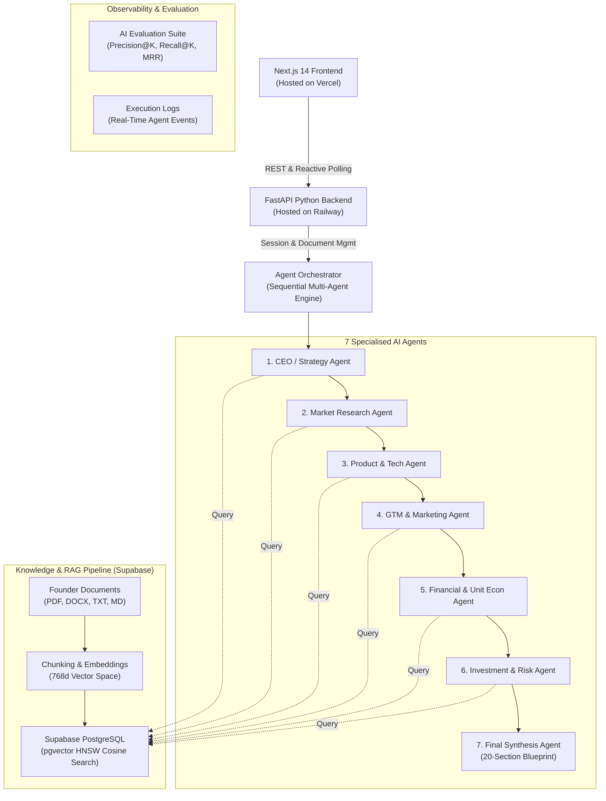

# VentureOS — Multi-Agent Venture Studio & Startup Intelligence Engine

> **Submit a startup idea and founder documents. Receive an investor-grade, 20-section venture blueprint generated by a coordinated team of 7 specialised AI agents grounded in real founder documents via pgvector semantic search.**

[](https://frontend-amber-ten-59.vercel.app)
[](https://frontend-amber-ten-59.vercel.app)
[](https://capable-unity-production.up.railway.app)
[](https://supabase.com)
[](https://ai.google.dev/)

---

## 🌐 Live Production Links

| Resource | Direct Link |
| :--- | :--- |
| 🚀 **Live Deployed Website (Frontend)** | [https://frontend-amber-ten-59.vercel.app](https://frontend-amber-ten-59.vercel.app) |
| ⚡ **Live Production API (Railway)** | [https://capable-unity-production.up.railway.app](https://capable-unity-production.up.railway.app) |
| 🩺 **Backend Healthcheck** | [https://capable-unity-production.up.railway.app/health](https://capable-unity-production.up.railway.app/health) |
| 📑 **Interactive Swagger API Docs** | [https://capable-unity-production.up.railway.app/docs](https://capable-unity-production.up.railway.app/docs) |
| 🔬 **Live Strategy Room Demo (Completed Session)** | [https://frontend-amber-ten-59.vercel.app/analyse?session=7a340771-ae5c-4ce4-9a1f-fd8fe4bb4979](https://frontend-amber-ten-59.vercel.app/analyse?session=7a340771-ae5c-4ce4-9a1f-fd8fe4bb4979) |
| 📦 **GitHub Repository** | [https://github.com/Kaustubh-kodes/VentureOs](https://github.com/Kaustubh-kodes/VentureOs) |

---

## 🏛️ 1. Architecture Overview

VentureOS is architected as a modern, decoupled production system designed for enterprise-grade scalability and grounded venture intelligence:

* **Frontend:** Next.js 14 with TypeScript, Tailwind CSS, and Framer Motion (Deployed on **Vercel**).
* **Backend:** Async FastAPI engine with sequential agent orchestration and streaming telemetry (Deployed on **Railway**).
* **Database & Vector Store:** Supabase PostgreSQL with `pgvector` HNSW indexing for high-dimensional semantic search (Hosted on **Supabase**).
* **AI Model Engine:** Google Gemini (`gemini-3.5-flash`) for multi-agent reasoning and `gemini-embedding-001` for RAG chunk embeddings.



---

## 🤖 2. The 7 Specialised Agents

1. **CEO / Strategy Agent**: Synthesizes the core startup thesis, vision, and long-term defensive moats.
2. **Market Research Agent**: Maps ICP personas, computes TAM/SAM/SOM market sizing, and evaluates competitor landscape.
3. **Product & Tech Agent**: Formulates MVP features, technical architecture, and scalability guardrails.
4. **Marketing / GTM Agent**: Generates customer acquisition channels, viral growth loops, and brand positioning.
5. **Finance Agent**: Projects unit economics (CAC, LTV, payback period), burn rate, and runway milestones.
6. **Investment / Risk Agent**: Calculates a calibrated venture score (0–100), red flags, and funding readiness.
7. **Final Synthesis Agent**: Consolidates all outputs into a cohesive 20-section report, surfaces contrarian contradictions, and crafts actionable 30/90-day execution roadmaps.

---

## 🚀 3. Complete Step-by-Step Live Deployment Guide

VentureOS connects **Supabase** (Database & Vector Store), **Railway** (FastAPI Backend), and **Vercel** (Next.js Frontend). Follow these exact steps to deploy your own instance.

```
User Browser
     │
     ▼ HTTPS
Vercel (Next.js 14 Frontend) ───▶ https://frontend-amber-ten-59.vercel.app
     │
     ▼ HTTPS REST
Railway (FastAPI Backend)    ───▶ https://capable-unity-production.up.railway.app
     │
     ├── Google Gemini API (gemini-3.5-flash)
     │
     └── Supabase PostgreSQL     ───▶ Database & pgvector Knowledge Store
```

---

### Step 1: Database Setup on Supabase

1. **Create a Supabase Project:**
   - Go to [supabase.com](https://supabase.com) and create a free account or sign in.
   - Click **New Project**, select your organization, name your project (e.g. `ventureos-db`), and set a strong database password.
   - Select your preferred region (e.g. `US East` or `EU Central`).

2. **Run the Database Migrations:**
   - Open your project dashboard and click on **SQL Editor** in the left sidebar.
   - Execute each SQL migration from the `backend/database/migrations/` directory in sequential order:
     1. **`001_create_startup_sessions.sql`** — Creates `startup_sessions` table and status check triggers.
     2. **`002_create_rag_knowledge_base.sql`** — Enables the `pgvector` extension, creates `knowledge_documents` and `document_chunks` (768-dimensional vector embeddings), and defines the `match_document_chunks` RPC for cosine similarity search.
     3. **`003_add_multi_agent_support.sql`** — Creates `agent_outputs` and `agent_execution_logs` for multi-agent persistence and observability.
     4. **`004_add_analysis_events_and_durations.sql`** — Adds execution duration tracking and observability indexes.
     5. **`005_evaluation_runs_and_hardening.sql`** — Creates `evaluation_runs` table and performance indexes.

3. **Create the Document Storage Bucket:**
   - Navigate to **Storage** in the Supabase sidebar.
   - Click **New Bucket**, name it `ventureos-documents`, and set it to **Public** (or configure access policies).
   - This bucket stores uploaded founder pitch decks, business plans, and whitepapers.

4. **Collect API Credentials:**
   - Go to **Project Settings** &rarr; **API**.
   - Copy the **Project URL** (format: `https://<your-project-id>.supabase.co`).
   - Copy the **service_role key** (secret key used securely by the Railway backend) or **anon key**.

---

### Step 2: Backend Deployment on Railway

1. **Create New Project on Railway:**
   - Go to [railway.app](https://railway.app) and log in with GitHub.
   - Click **New Project** &rarr; **Deploy from GitHub repo**.
   - Select `Kaustubh-kodes/VentureOs`.

2. **Configure Service Settings:**
   - Click on your newly added service card and go to the **Settings** tab.
   - In **Root Directory**, set it to `backend` (or leave empty; the root `railway.json` automatically runs `cd backend && uvicorn app.main:app --host 0.0.0.0 --port ${PORT:-8000}`).
   - Under **Healthcheck Path**, enter `/health`.
   - Set **Healthcheck Timeout** to `120` seconds.

3. **Generate Public Domain (Public URL):**
   - In the service view, click the **Settings** tab &rarr; scroll down to **Networking**.
   - Under **Public Networking**, click **Generate Domain**.
   - Railway will assign a public URL such as `capable-unity-production.up.railway.app`.

4. **Add Backend Environment Variables:**
   - Click the **Variables** tab in Railway and add the following:

| Variable Name | Value / Description | Example |
| :--- | :--- | :--- |
| `ENVIRONMENT` | Deployment environment mode | `production` |
| `PORT` | Web server listening port | `8000` |
| `GEMINI_API_KEY` | Your Google Gemini API Key from Google AI Studio | `AIzaSy...` |
| `GEMINI_MODEL` | Preferred Gemini model | `gemini-3.5-flash` |
| `SUPABASE_URL` | Your Supabase Project URL | `https://your-project.supabase.co` |
| `SUPABASE_KEY` | Supabase Service Role / Anon Key | `eyJhbGciOi...` |
| `SUPABASE_STORAGE_BUCKET` | Storage bucket name for founder docs | `ventureos-documents` |
| `CORS_ORIGINS` | Allowed frontend origins (JSON array or comma-separated) | `["https://frontend-amber-ten-59.vercel.app", "http://localhost:3000"]` |
| `FRONTEND_URL` | Production frontend URL | `https://frontend-amber-ten-59.vercel.app` |

5. **Verify Backend Deployment:**
   - Visit `https://your-railway-domain.up.railway.app/health` in your browser.
   - Expected JSON response:
     ```json
     {"status": "healthy", "service": "ventureos-api", "version": "0.9.0"}
     ```
   - Visit `https://your-railway-domain.up.railway.app/docs` to test interactive Swagger documentation.

---

### Step 3: Frontend Deployment on Vercel

1. **Import Project to Vercel:**
   - Go to [vercel.com](https://vercel.com) and log in.
   - Click **Add New** &rarr; **Project** &rarr; select `Kaustubh-kodes/VentureOs`.

2. **Configure Project Settings:**
   - **Framework Preset:** `Next.js`
   - **Root Directory:** Click **Edit** and choose `frontend`.
   - **Build Command:** `npm run build`
   - **Output Directory:** `.next`
   - **Node.js Version:** `18.x` or `20.x`

3. **Set Frontend Environment Variable:**
   - Under **Environment Variables**, add:
   
| Variable Name | Value | Description |
| :--- | :--- | :--- |
| `NEXT_PUBLIC_API_URL` | `https://capable-unity-production.up.railway.app` | The public Railway backend URL |

4. **Deploy & Validate:**
   - Click **Deploy**. Vercel will build and deploy the Next.js frontend globally.
   - Open your Vercel URL (e.g. `https://frontend-amber-ten-59.vercel.app`).
   - Navigate to the **Analyse** page, submit a venture idea, and observe all 7 agents orchestrate in the real-time Strategy Room!

---

## 💻 4. Local Development Setup

If you wish to run the entire stack locally on your machine:

### Prerequisites
* Python 3.10+
* Node.js 18+ and npm
* Active Supabase project (or local Supabase CLI)
* Google Gemini API Key

### 1. Clone Repository
```bash
git clone https://github.com/Kaustubh-kodes/VentureOs.git
cd VentureOs
```

### 2. Backend Setup
```bash
cd backend
python -m venv .venv

# Windows:
.\.venv\Scripts\activate
# Mac / Linux:
source .venv/bin/activate

pip install -r requirements.txt

# Configure Environment
cp .env.example .env
# Edit .env and supply GEMINI_API_KEY, SUPABASE_URL, and SUPABASE_KEY

# Start FastAPI server
uvicorn app.main:app --reload --port 8000
```
API Documentation will be live at: `http://localhost:8000/docs`

### 3. Frontend Setup
```bash
cd ../frontend
npm install

# Configure local API endpoint
echo "NEXT_PUBLIC_API_URL=http://localhost:8000" > .env.local

# Launch Next.js dev server
npm run dev
```
Open [http://localhost:3000](http://localhost:3000) in your browser.

---

## 📊 5. Evaluation Framework & Observability

VentureOS includes an integrated quality and accuracy evaluation suite (`backend/app/evaluation/`):

- **RAG Retrieval Evaluation**:
  - **Precision@K**: Measures accuracy of retrieved founder document chunks.
  - **Recall@K**: Evaluates knowledge completeness across pitch decks and data rooms.
  - **MRR (Mean Reciprocal Rank)**: Validates ranking quality for grounding context.
- **Multi-Agent Execution Observability**:
  - Step duration tracking (in milliseconds).
  - Cross-agent contradiction detection and synthesised resolution.
  - Automatic fallback retry handling with JSON repair flows.

---

## 📜 6. License & Author

Crafted by **Kaustubh Tiwari** as part of the **VentureOS Multi-Agent Venture Intelligence Initiative**.  
Licensed under the [MIT License](LICENSE).
